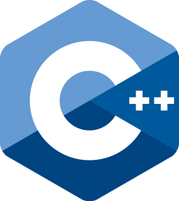

## Michael Warmbier

### A Computer Science and Mathematics B.S. Candidate

Creator of [SmiteBuildMaker](http://Smitebuildmaker.com) and [ChanceForRain](chanceforrain.info/). Student and hobbyist.
### Connect with me:

[][website]
[][twitter]
[][myRepl]

 

### Languages:

 

---

[website]: http://michaelwarmbier.com
[twitter]: https://twitter.com/MichaelWarmbier
[youtube]: https://www.youtube.com/channel/UC1HP88o4kwLze82F2KDPoVw
[myRepl]: https://replit.com/@Kirbout

[github]: https://github.com/
[repl]: ttps://replit.com/
[atom]: https://atom.io/
[node]: https://nodejs.org/en/
[visualstudio]: https://code.visualstudio.com/
[gamemaker]: https://www.yoyogames.com/en/gamemaker
[markdown]: https://www.markdownguide.org/
[codepen]: https://codepen.io/

